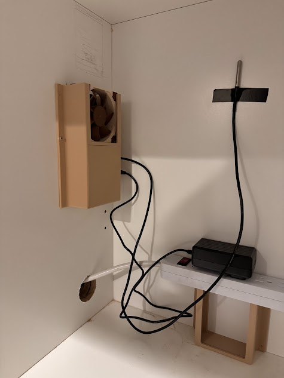

Iceman
=========

A temp sensor connected to a fan that I use to keep my ice maker cabinet nice and cool.





### Building

I'm cross compiling from a windows box to make life easier given how slow the pi zero can be when it comes to compilation.

```
# Add the arm target
rustup target add armv7-unknown-linux-gnueabihf

# Build in release mode for PI
cargo build  --release --target=armv7-unknown-linux-gnueabihf
```


### Deploying

There are some pretty fancy ways to deploy code but I'm just SCPing the target binary.


```
scp target/armv7-unknown-linux-gnueabihf/release/iceman pi@raspberrypi:~/iceman
```


### Running

I think systemd is the easiest way to configure and run. So for now here is my systemd service:

```
sudo cat /etc/systemd/system/iceman.service
[Unit]
Description=Iceman (Fan Controller)
After=multi-user.target

[Service]
EnvironmentFile=/srv/iceman/etc/env
ExecStart=/srv/iceman/bin/iceman
WorkingDirectory=/home/pi
StandardOutput=journal
StandardError=journal
Restart=always
User=pi

[Install]
WantedBy=multi-user.target
```

To run this I have the final `iceman` binary copied to `/srv/iceman/bin/iceman`. And then I use an `env` file which is kept at `/srv/iceman/etc/env` and loaded by systemd when iceman starts.

That `env` file looks like the following:

```
GRAFANA_API_INFLUXDB_URL=https://xxxxx.grafana.net/api/v1/push/influx/write
GRAFANA_API_USERNAME=xxxx
GRAFANA_API_PASSWORD=xxxx
```

NOTE: The influxdb url includes everything up to the "write" endpoint.


### Configuring the PI

Here is a snapshot of my config.txt file for a PI Zero W2:


```
# For more options and information see
# http://rptl.io/configtxt
# Some settings may impact device functionality. See link above for details
# Enable audio (loads snd_bcm2835)
dtparam=audio=on
# Automatically load overlays for detected cameras
#camera_auto_detect=1

# Automatically load overlays for detected DSI displays
#display_auto_detect=1

# Automatically load initramfs files, if found
auto_initramfs=1

# Enable DRM VC4 V3D driver
dtoverlay=vc4-kms-v3d
max_framebuffers=2

# Don't have the firmware create an initial video= setting in cmdline.txt.
# Use the kernel's default instead.
disable_fw_kms_setup=1

# Run in 64-bit mode
arm_64bit=1

# Disable compensation for displays with overscan
disable_overscan=1

# Run as fast as firmware / board allows
arm_boost=1

# From: https://forums.raspberrypi.com/viewtopic.php?t=322591
arm_freq=800
gpu_freq=300
sdram_freq=400

[all]
dtoverlay=w1-gpio
dtoverlay=pwm
```


### Metrics

This currently sends 3 metrics to grafana:

1. `fan_controller_cpu_temp` - The PI's cpu temp which is useful for overall system healthy.
2. `fan_controller_temp` - The current reported temp of the temp sensor probe.
3. `fan_controller_rpm` - The current RPM of the 12v PWM fan.


### License

MIT
